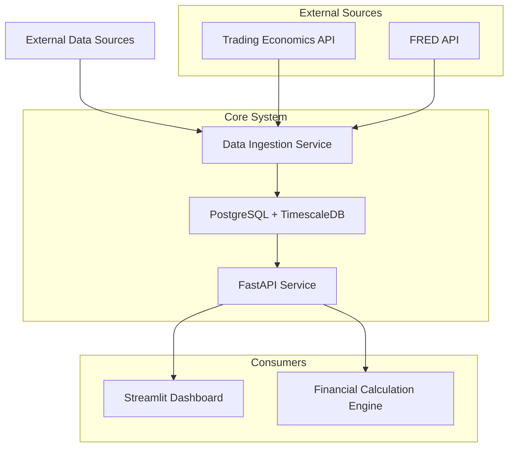

# State Fiscal Feed System Architecture

## Overview
The State Fiscal Feed system is designed to collect, process, and deliver state-level fiscal indicators for analyzing municipal securities and economic health. This architecture follows a clean separation of concerns between data ingestion and consumption.

## System Architecture



## Component Architecture

### 1. Data Ingestion Service
**Purpose**: Centralized service for sourcing external fiscal indicators
**Technology**: Python with FastAPI
**Responsibilities**:
- Poll Trading Economics API and FRED endpoints
- Handle authentication and rate limiting
- Data validation and normalization
- Store data in time-series database
- Handle upstream data gaps (forward-fill logic)

### 2. Time-Series Database
**Technology**: PostgreSQL with TimescaleDB extension
**Schema Design**:
```sql
CREATE TABLE state_fiscal_data (
    id SERIAL PRIMARY KEY,
    state_code CHAR(2) NOT NULL,
    data_timestamp TIMESTAMP NOT NULL,
    state_tax_receipts_yoy_growth FLOAT NOT NULL,
    state_budget_surplus_deficit_as_pct_of_gsp FLOAT NOT NULL,
    created_at TIMESTAMP DEFAULT NOW(),
    updated_at TIMESTAMP DEFAULT NOW()
);

CREATE INDEX idx_state_timestamp ON state_fiscal_data (state_code, data_timestamp);
```

### 3. API Service Layer
**Technology**: FastAPI with Pydantic models
**Endpoints**:
- `GET /api/v1/fiscal-data/{state}?date={date}` - Get fiscal data for state
- `GET /api/v1/fiscal-data/bulk?format=csv` - Export historical data
- `GET /api/v1/health` - Service health check

### 4. Streamlit Dashboard
**Technology**: Streamlit with Plotly for visualizations
**Features**:
- Interactive state selection
- Time-series visualizations
- Comparative analysis tools
- Data export functionality

### 5. Financial Calculation Engine (Consumer)
**Integration**: Consumes data exclusively from API Service Layer
**Constraint**: No direct external API connections

## Data Flow

1. **Data Ingestion Flow**:
   ```
   Trading Economics API → Data Ingestion Service → Validation → Database
   FRED API → Data Ingestion Service → Validation → Database
   ```

2. **Data Delivery Flow**:
   ```
   Database → API Service → JSON Response → Consumer Applications
   Database → API Service → CSV Export → Historical Analysis
   ```

## Technology Stack

### Backend
- **Language**: Python 3.9+
- **Framework**: FastAPI
- **Database**: PostgreSQL with TimescaleDB
- **ORM**: SQLAlchemy
- **Task Queue**: Celery with Redis
- **Caching**: Redis
- **API Documentation**: Swagger/OpenAPI

### Frontend
- **Dashboard**: Streamlit
- **Visualization**: Plotly
- **Data Export**: Pandas

### DevOps
- **Containerization**: Docker
- **Orchestration**: Docker Compose
- **Testing**: pytest
- **CI/CD**: GitHub Actions
- **Monitoring**: Prometheus + Grafana

## Security Considerations

1. **API Security**:
   - Rate limiting on all endpoints
   - Input validation and sanitization
   - API key management for external services

2. **Data Security**:
   - Database encryption at rest
   - Secure credential management
   - Network security (VPC, security groups)

3. **Access Control**:
   - Service-to-service authentication
   - Role-based access for dashboard users

## Performance Optimizations

1. **Database**:
   - Time-series partitioning
   - Proper indexing strategy
   - Connection pooling

2. **API Layer**:
   - Response caching
   - Pagination for large datasets
   - Async request handling

3. **Dashboard**:
   - Data virtualization for large tables
   - Lazy loading of visualizations
   - Efficient data aggregation

## Error Handling Strategy

1. **External API Failures**:
   - Retry logic with exponential backoff
   - Circuit breaker pattern
   - Fallback to cached data

2. **Data Quality Issues**:
   - Validation at ingestion
   - Data quality alerts
   - Forward-fill for missing values

3. **Service Failures**:
   - Graceful degradation
   - Health check endpoints
   - Comprehensive logging

## Deployment Architecture

```
Production Environment:
├── Load Balancer
├── API Service (2 instances)
├── Database (Primary + Replica)
├── Redis Cache
├── Monitoring Stack
└── Streamlit Dashboard
```

## Compliance with StateFiscalFeed Requirements

✅ **SFF-AR-01**: Dedicated State Fiscal Data Ingestion Service implemented
✅ **SFF-AR-02**: Financial Calculation Engine consumes only from our API
✅ **SFF-AR-03**: Periodic polling and persistence in time-series store
✅ **SFF-DR-01**: Provides required indicators as single data object
✅ **SFF-DR-02**: All indicators delivered as float data types
✅ **SFF-DR-03**: Guarantees no null values (forward-fill logic)
✅ **SFF-DC-01**: Synchronous API endpoint with state/date parameters
✅ **SFF-DC-02**: Returns latest data on or before specified date
✅ **SFF-DC-03**: JSON response conforms to specified schema
✅ **SFF-DC-04**: Historical CSV export functionality
✅ **SFF-DC-05**: Column headers match data dictionary exactly
✅ **SFF-NFR-01**: Data updated within 5 business days of publication