# System Architecture Diagrams

## System Overview

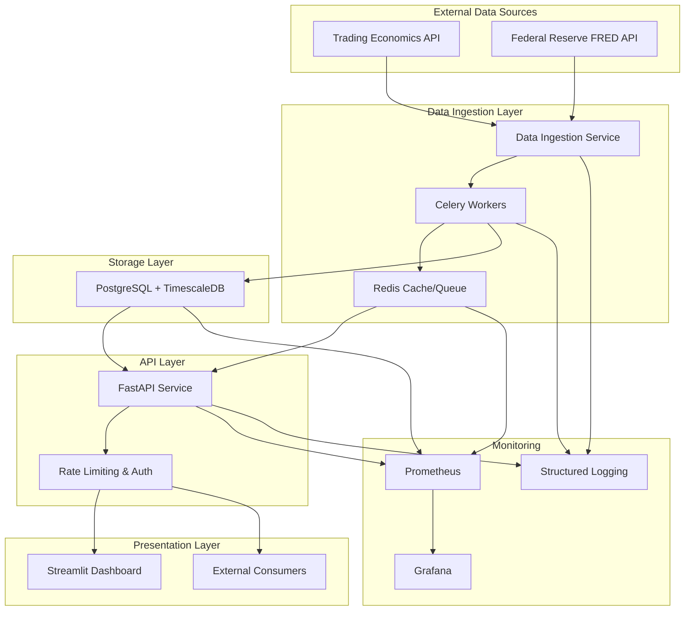

## Data Flow Diagram

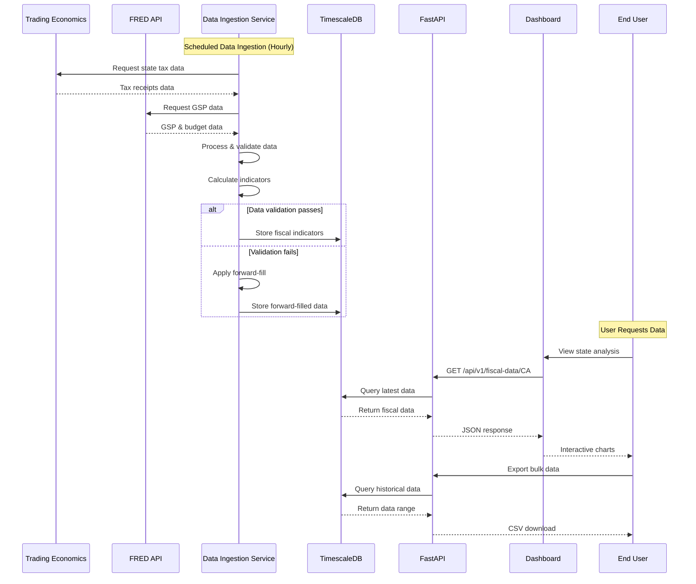

## Component Architecture

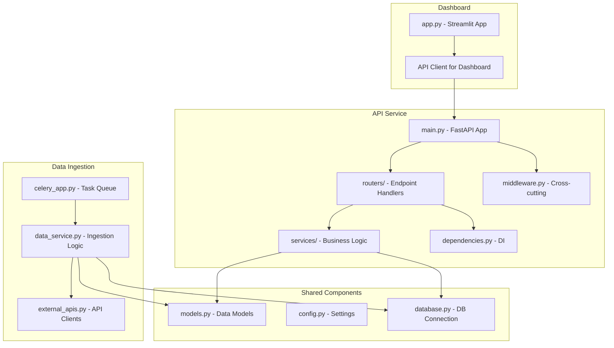

## Database Schema

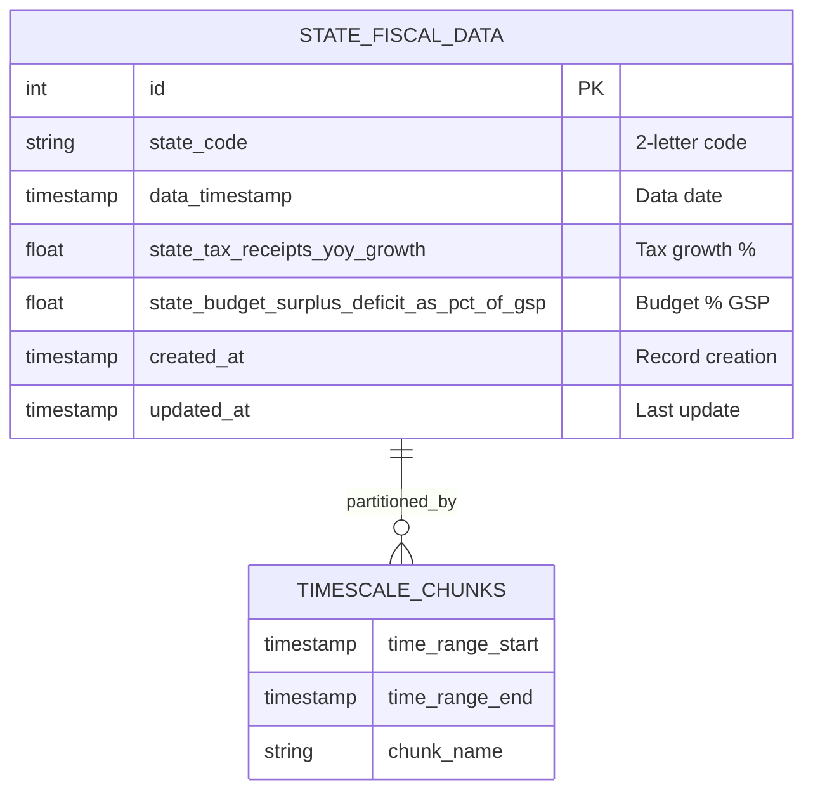

## API Request Flow

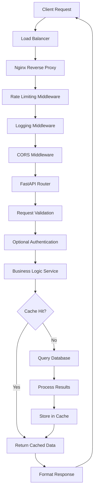

## Data Ingestion Architecture

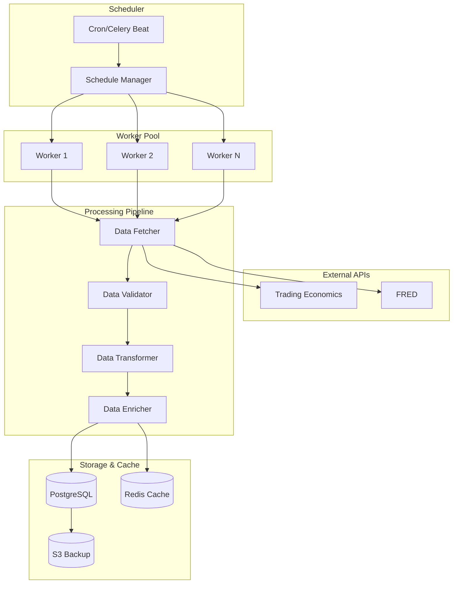

## Deployment Architecture

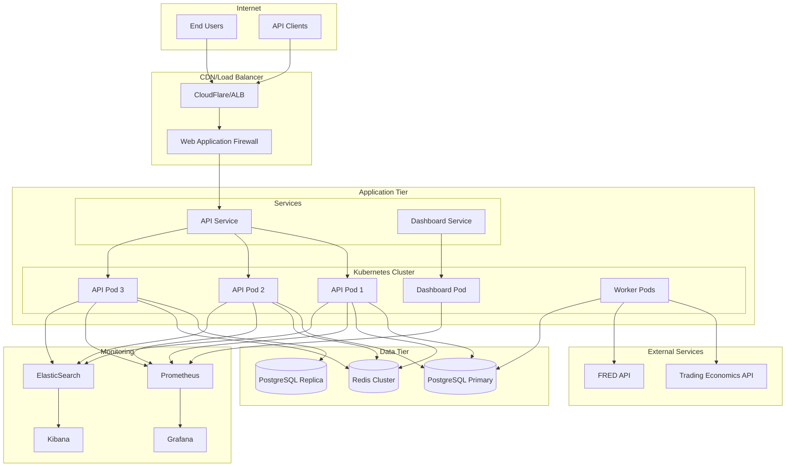

## Security Architecture

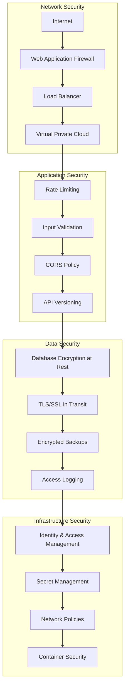

## Monitoring and Observability

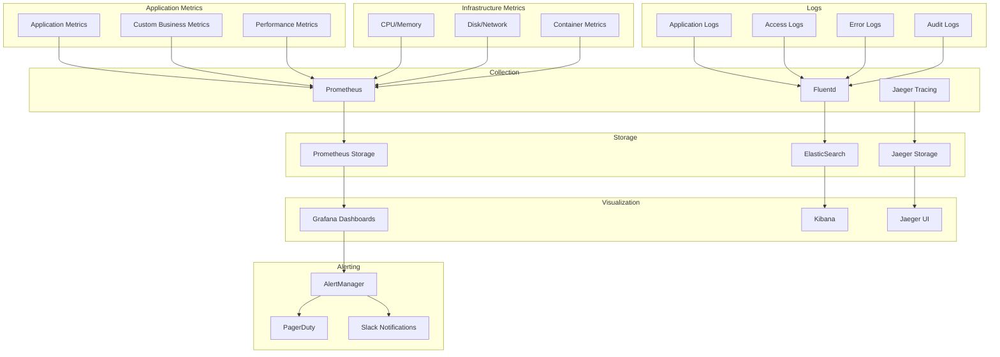

## Data Processing Pipeline

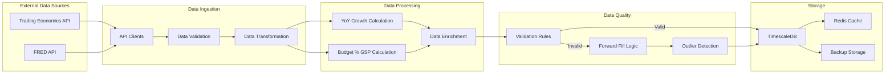

## Disaster Recovery Architecture

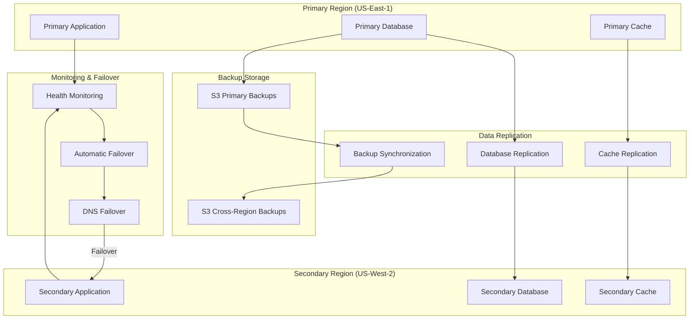

These diagrams provide a comprehensive visual representation of the State Fiscal Feed system architecture, covering all major components, data flows, and operational aspects of the system.